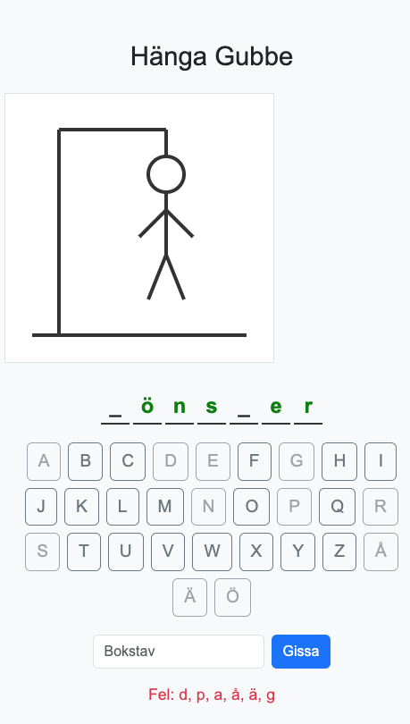

# Hänga Gubbe

Ett klassiskt svenskt "Hänga Gubbe"-spel byggt med HTML5, JavaScript och Bootstrap.

## Funktioner

- 100 slumpade svenska ord (saker, djur, platser)
- Onscreen-tangentbord och textinmatning
- Galge som ritas ut i 10 steg
- 10 försök per spelomgång
- Felaktiga bokstäver visas
- När man förlorar ritas ögon, näsa och ledsen mun
- Responsiv och mobilvänlig design

## Så här spelar du

1. Starta spelet genom att öppna [`index.html`](https://htmlpreview.github.io/?https://github.com/hakimsjo/hangman/blob/main/index.html) i din webbläsare.
2. Gissa bokstäver via tangentbordet på skärmen eller genom att skriva i textrutan.
3. Du har 10 försök på dig att gissa ordet.
4. Vid vinst eller förlust kan du starta om spelet.
